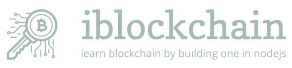

<p>
  
</p> 

## 功能

- 学习区块链的演示demo
- 简单的挖矿、交易、P2P网络的实现
- 一系列demo演示命令，辅助理解blockchain

## 安装

```bash
npm install -g iblockchain
```

## 上手

执行`iblockchain` 后 进入demo页面

```
Welcome to iblockchain !

  Commands:

    help [command...]             Provides help for a given command.
    exit                          Exits application.
    mine                          开始挖矿
    blockchain                    查看整个区块链 [bc]
    pending                       查看还没有打包进区块的交易
    trans <to> <amount>           给人转账
    blance [address]              查看地址的余额
    pub                           本地公钥(公钥就是地址)
    prv                           本地私钥
    detail <index>                查看第n个区块的详情
    peer                          查看P2P网络节点
    --------我是分割线--------
    hash <value>                  [演示] 计算sha256哈希
    minedemo <data> <difficulty>  [演示] 挖矿计算逻辑
    getpub <value>                [演示] 根据私钥计算出公钥(私钥加密 公钥解密，公钥可以从私钥计算出来)
    sign <value> <prv>            [演示] 用私钥加密信息 得到签名
    verify <value> <pub> <sig>    [演示] 使用签名 校验信息 <消息> <公钥> <签名>
    valid                         [演示] 区块链是否合法
    update <index>                [演示] 篡改<index>个block的数据,第一个转账信息amount+1
    mineblock <index>             [演示] 对<index>个上的区块数据重新挖矿,使其变成合法的小块块

iblockchain => [信息]: UDP服务监听完毕: 0.0.0.0:51881
[信息]: 更新本地区块链
iblockchain => 
// 继续输入命令 体验功能

```


## 上手

**查看整个区块链数据 blockchain**

``` bash
iblockchain => blockchain
```

**挖矿,新增区块 mine**

``` bash
iblockchain => mine
```


## 更多信息

- [知乎](https://www.zhihu.com/people/woniuppp/activities)

## 协议

MIT

